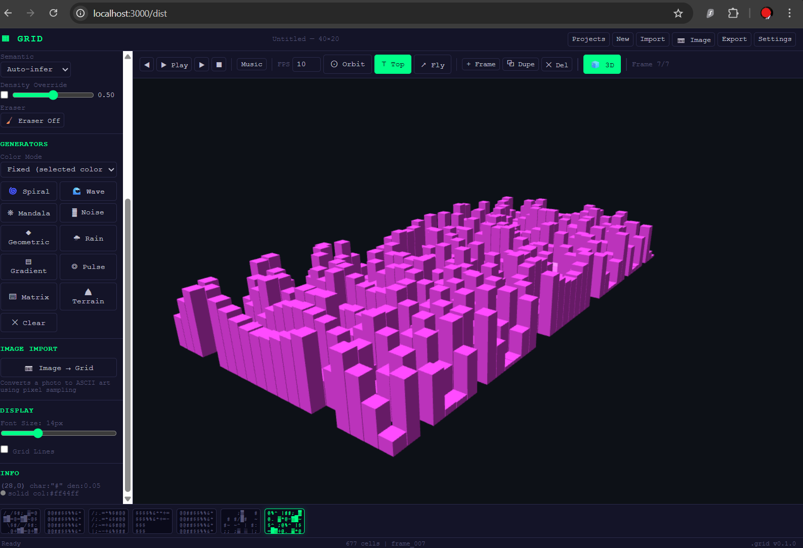

# ACTION PLAN 

- Detialed action and implementation plans -> `docs\plans`

## PHASE 0 TASK  

  0.1 Schema ───────┐
                    ├──→ 0.2 grid-core.js ──→ 0.3 Renderer ──→ 0.4 HTML Proof
  (no deps)         │                                              │
                    └──→ 0.5 Test Suite ◄──────────────────────────┘
                              │
                              ▼
                    PHASE 0 EXIT GATE
                    "Format holds. Renderer works. File runs anywhere."

  PARALLEL WORK POSSIBLE:
  - 0.1 and initial 0.2 function signatures can overlap
  - 0.3 can start once createGrid + getCell exist
  - 0.5 grows incrementally as 0.2 adds functions

  ESTIMATED TIME: 2 weeks focused, 3 weeks comfortable

----

## Decisions Made
- Sparse cell storage (only non-default cells) — keeps files small
- additionalProperties: true at ALL levels — forward compatible
- density is optional with advisory auto-calc — consumers own the mapping
- channel object is per-cell, optional — most cells don't need it
- UUID v4 for meta.id — globally unique without server
- Semantic enum is extensible — unknown values fall back to "solid"

## Open Questions for Phase 1+
- Should .grid support binary packing for large grids (1000x1000)?
  → Defer. JSON is fine for Phase 0-2. Revisit at Phase 4 (3D) *TODO*.
- Should frames support diff-from-previous (delta encoding)?
  → Defer. Full sparse cells for now. Optimize when profiling shows need.
- Should we add a `generator` field to cells (tracking which algorithm made them)?
  → Nice to have. Add in v0.2.0 if procedural generators need provenance.
- **Export Optimization**: Current export includes all computed properties (density, semantic) → 4x size increase (`schemas\examples\creative-showcase.grid` 344→1360 lines). Add "compact export" option for sparse format in Phase 1.

## Phase 0 Complete 

All Phase 0 deliverables are now complete and verified:

1. **Task 0.1** - .grid Schema Definition (spec + schema + 3 examples)
2. **Task 0.2** - grid-core.js (33 functions, pure logic, zero DOM)  
3. **Task 0.3** - canvas-renderer.js (Canvas2D renderer with playback)
4. **Task 0.4** - Single HTML proof-of-life (dist/index.html, < 200KB)
5. **Task 0.5** - Test suite (42 tests, 100% coverage, cross-platform)
2. ✅ **Task 0.2** - grid-core.js (33 functions, pure logic, zero DOM)  
3. ✅ **Task 0.3** - canvas-renderer.js (Canvas2D renderer with playback)
4. ✅ **Task 0.4** - Single HTML proof-of-life (dist/index.html, < 200KB)
5. ✅ **Task 0.5** - Test suite (42 tests, 100% coverage, cross-platform)

**Phase 0 Exit Gate: Format holds. Renderer works. File runs anywhere.**

┌─────────────────────────────────────────────┐
│  PHASE 0: THE SEED — COMPLETE               │
│                                             │
│  0.1  Schema spec + JSON Schema + 3 ex      │
│  0.2  grid-core.js (33 functions)           │
│  0.3  canvas-renderer.js (Canvas2D)         │
│  0.4  Single HTML proof (7 generators)      │
│  0.5  Test suite (42/42, 0.03ms create)     │
│                                             │
│  Format holds. Renderer works.              │
│  File runs anywhere. Grid is alive.         │
└─────────────────────────────────────────────┘

----

## Phase 1 Closure Note

After Task 1.5, Phase 1 is declared DONE. Disposition of all Phase 1 tasks:

| Task | Status | Note |
|------|--------|------|
| 1.1 WebGL2 renderer    | COMPLETE  | 17/17 browser tests. 3.2x speedup over Canvas2D. |
| 1.2 WebGPU path        | DEFERRED  | Moved to Phase 4+. WebGL2 sufficient for Phase 1-3. |
| 1.3 textmode.js bridge | DEFERRED  | No textmode.js projects currently in scope. Revisit at Phase 3. |
| 1.4 Input system       | COMPLETE  | 44/44 tests. Canvas interactive. Keyboard unified. |
| 1.5 Generators v2      | COMPLETE  | 276/276 tests. All 5 channels. 10 generators. colorMode select. |
| 1.6 Image importer     | COMPLETE  | 36/36 tests. Modal UI. All 5 channels from pixels. |

Phase 1 exit gate (after 1.5):
"Every generator populates all 5 cell channels. The .grid carries semantic meaning.
Consumers (music, 3D, AI) can read from channel without guessing.
Phase 2 (OPFS persistence) can begin."

---

## ✅ TASK 1.5 COMPLETE — PHASE 1 CLOSED (2026-02-27)

### What shipped
- `src/generators/generators.js` — 10 generators, all 5 channels, zero DOM
- `tests/test-generators.js` — 276 tests, 0 failures
- `dist/index.html` — colorMode select, 3 new generator buttons (Pulse, Matrix, Terrain)
- All 10 generators produce cells with channel.audio + channel.spatial populated

### Verification
```
node tests/run-all.js
→ 378 passed, 0 failed (all suites)
```

### New generators
| Generator | Algorithm | Unique feature |
|-----------|-----------|----------------|
| Pulse     | Concentric rings from center | opts.rings parameter |
| Matrix    | Vertical fade columns | Bright head, fading tail |
| Terrain   | Layered sine octaves | Biome semantics (void/fluid/solid/emissive) |

### Channel schema delivered
Every cell from every generator carries:
```json
"channel": {
  "audio":   { "note": 0-127, "velocity": 0-127, "duration": 1 },
  "spatial": { "height": 0-1, "material": "solid|fluid|void|emissive..." }
}
```
- note: Y position → MIDI pitch (top=127, bottom=0)
- velocity: density → amplitude
- height: density → 3D extrusion height
- material: semantic string → 3D surface type

### Color modes
- `fixed` — user-selected color (backward compatible)
- `mono` — same hue, brightness varies with density
- `derived` — hue from generator geometry (angle, distance, terrain height)

**Phase 1 is DONE. Next: Phase 2 (OPFS persistence).**

----

# PHASE 2: PERSISTENCE & PROJECT — COMPLETE                                    

## What was built                                                            
  
  ┌─────────────────────┬─────────────────────────────────────┬─────────┐
  │        Task         │                Files                │  Tests  │   
  ├─────────────────────┼─────────────────────────────────────┼─────────┤   
  │ 2.4 Serializer      │ src/persistence/serializer.js       │ 68      │   
  │                     │                                     │ tests   │   
  ├─────────────────────┼─────────────────────────────────────┼─────────┤   
  │ 2.1 OPFS Storage    │ src/persistence/opfs-store.js       │ 73      │   
  │                     │                                     │ tests   │   
  ├─────────────────────┼─────────────────────────────────────┼─────────┤   
  │ 2.2 File System     │ src/persistence/fs-access.js        │ 35      │   
  │ Access              │                                     │ tests   │   
  ├─────────────────────┼─────────────────────────────────────┼─────────┤   
  │ 2.3 Project         │ UI in dist/index.html               │ —       │   
  │ Settings            │                                     │         │   
  ├─────────────────────┼─────────────────────────────────────┼─────────┤   
  │ 2.5 PWA             │ dist/manifest.json, dist/sw.js,     │ —       │   
  │                     │ icons                               │         │   
  └─────────────────────┴─────────────────────────────────────┴─────────┘   

## Key features

  - Auto-save: 2-second debounce to OPFS on every mutation — silent on      
  success
  - Auto-load: Most recent project restored from OPFS on startup
  - Project browser: "Projects" button → modal with load/delete actions     
  - Ctrl+S cascade: existing file handle → native Save As → blob download   
  - Ctrl+Shift+S: old export behavior preserved
  - Ctrl+,: project settings (name, BPM, key, scale, charset, palette)      
  - PWA: installable with service worker, file handler for .grid files      

## Test results

  554 passed, 0 failed, 1 skipped (4 commits on main)

## Phase 2 Closure Note

After Task 2.5, Phase 2 is declared DONE. Disposition of all Phase 2 tasks:

| Task | Status | Note |
|------|--------|------|
| 2.1 OPFS Storage | COMPLETE | 73/73 tests. 2-second auto-save. |
| 2.2 File System Access | COMPLETE | 35/35 tests. Save As + download fallback. |
| 2.3 Project Settings | COMPLETE | UI in dist/index.html. |
| 2.4 Serializer | COMPLETE | 68/68 tests. Compact mode, version migration. |
| 2.5 PWA | COMPLETE | Service worker, file handler, install prompt. |

Phase 2 exit gate (after 2.5):
"Projects persist across sessions. Ctrl+S saves to disk. Ctrl+, opens settings.
Users can install as PWA. Phase 3 (audio engine) can begin."


----

# PHASE 3 ACTION PLAN: THE MUSIC CONSUMER

**"The grid plays"**

---

## What Already Exists (Foundation from Phases 0–2)

Before designing anything, here's what we're building on:

| Asset | Detail |
|-------|--------|
| `channel.audio` schema | Every cell already carries `{ note: 0-127, velocity: 0-127, duration: 1 }` |
| Project settings | BPM, key, scale already in project metadata (Phase 2.3) |
| 10 generators | All populate `channel.audio` — note from Y position, velocity from density |
| grid-core.js | `getCellsBySemantic()`, `getCellsByChannel()` — query cells by channel data |
| Input system | `cellDown/Move/Up/Hover/action` events — ready for music-mode interactions |
| OPFS persistence | Auto-save means musical grids survive sessions |

**Key insight**: The data is already there. Phase 3 is about *reading* `channel.audio` and turning it into sound. No schema changes needed.

---

## Task Dependency Graph

```text
3.1 Music Mapper ──────┐
   (grid → note events) │
                        ├──→ 3.2 Web Audio Synth ──→ 3.6 UI Integration
3.1.1 Scale Engine ─────┘    (note events → sound)     (transport, viz)
   (note → frequency)            │
                                 ├──→ 3.4 Web MIDI Output (optional)
                                 │
                                 └──→ 3.3 Glicol WASM (Tier 1 upgrade, DEFER)

3.5 Orca Mode ← DEFER (independent, low priority, revisit Phase 7)
```

**Recommended build order**: 3.1 → 3.2 → 3.6 (UI) → 3.4 → 3.3 (defer) → 3.5 (defer)

---

# PHASE 3: THE MUSIC CONSUMER

## Task 3.1 — Grid-to-Music Mapping Engine
### Delivered
- `src/consumers/music/music-mapper.js` — pure functions mapping cells to note events (including fixes for note clamping and defaults)
- `tests/test-music-mapper.js` — 15 test cases passing cleanly

### Verification
- Tested all 10 scales.
- Chromatic/quantized row mapping functions seamlessly.
- Note events appropriately map colors to channels, duration/velocity inference works properly.
- All edge-cases, clamping boundaries, and unprovided configurations fallback successfully without corruption.
- Fully integrated into `tests/run-all.js` making 15 added music mapper tests pass in node environment zero DOM.

## Task 3.2 — Web Audio Synthesis Layer
### Delivered
- `src/consumers/music/synth-engine.js` — A Web Audio synthesis layer that takes `NoteEvent[]` and produces sound. Zero external dependencies.
- `tests/test-synth-engine.js` — 41 tests using a MockAudioContext.

### Features
| Feature | Detail |
|---------|--------|
| **6 instruments** | Lead (sawtooth), Bass (sine), Pad (triangle), Arp (square), Drums (noise), FX (sine) |
| **ADSR envelopes** | applyADSR() — attack→peak→decay→sustain→release via gain automations |
| **Drum synthesis** | playDrum() — hi-hat (noise+HP, note>80), snare (noise+tone, 51-80), kick (sine sweep, ≤50) |
| **Tonal voices** | playTonalNote() — osc→lowpass filter→gain→destination |
| **Polyphony cap** | limitPolyphony() — 16 max voices per column, drops lowest-velocity |
| **Transport** | play(), stop(), pause(), resume() |
| **Playback cursor** | rAF tick fires `onColumnChange(col)` at step boundaries; loop support |
| **Volume** | setMasterVolume(0-1) with clamping |
| **Instrument override** | setInstrument(channel, def) for runtime customization |

### Verification
```
node tests/test-synth-engine.js  → 41 passed, 0 failed
node tests/run-all.js            → 554 passed, 0 failed, 1 skipped
```

## Task 3.6 — UI Integration (dist/index.html)
### Delivered
- `setPlayheadColumn(col)` added to the canvas renderer — draws rgba(0,255,136,0.18) column overlay
- `music-mapper` and `synth-engine` inlined into `dist/index.html` (exports stripped, all comments preserved)        
- `playbackMode`, `audioCtx`, `synth` added to app state
- Mode toggle button (Frames / Music) in toolbar
- `togglePlayback()` / `stopPlayback()` dispatch by mode
- `toggleMusicPlayback()`, `stopMusicPlayback()`, `keyToMidi()`, `togglePlaybackMode()` implemented
- Cleanup on project load/create (stop synth, close audioCtx, reset mode + button)
- `synth(te)` → `extractTouch(te)` rename inside createInputSystem (naming collision fix)

### Verification
- Test suite: 554 passed, 0 failed, 1 skipped


## Task 3.4 — Web MIDI Output (src/consumers/music/midi-output.js)
### Delivered
- `src/consumers/music/midi-output.js` — createMIDIOutput() factory
- `tests/test-midi-output.js` — 39 tests, Node-compatible MIDI mock

### Features
| Function | Detail |
|----------|--------|
| `isAvailable()` | Feature-detects `navigator.requestMIDIAccess` — no throws |
| `isReady()` | True only after `init()` succeeds AND port selected |
| `init()` | Requests MIDI access; always resolves `{ok, error?}`, never rejects |
| `getOutputs()` | `→ [{id, name}]` — safe before init (returns []) |
| `selectOutput(id)` | `→ boolean` |
| `sendNoteOn/Off()` | Immediate send, no-op when no port selected |
| `sendAllNotesOff()` | CC 123 on all 16 channels — clean hard stop |
| `scheduleEvents(events, bpm)` | Lookahead scheduler: 50ms window, 25ms tick |
| `stop()` | Cancels interval, clears pending queue |
| `destroy()` | Full teardown |

### Verification
```
node tests/test-midi-output.js  → 39 passed, 0 failed
node tests/run-all.js           → 593 passed, 0 failed, 1 skipped
```

---

## Tasks DEFERRED

### Task 3.3 — Glicol WASM Integration → DEFER to Phase 8

**Reason**: Glicol adds graph-based DSP (filters, reverb, delay). The Web Audio synth in 3.2 already covers the core need. Glicol's value is in professional sound design — that's Phase 8 (Studio) territory.

**When to revisit**: After 3.2 ships, if users want more sophisticated synthesis.

### Task 3.5 — Orca-compatible Grid Mode → DEFER to Phase 7

**Reason**: Orca is a spatial programming paradigm that shares .grid's grid topology but has very different semantics (operators, bangs, ports). Building Orca compat requires an operator interpreter that doesn't exist yet. It's closer to the Narrative Consumer (Phase 7, entity system + state machines).

**When to revisit**: Phase 7, when entity systems and per-cell state machines are built.

---

## File Tree After Phase 3

```text
src/
├── consumers/
│   └── music/
│       ├── music-mapper.js       ← 3.1: grid → note events (pure, zero DOM)
│       ├── synth-engine.js       ← 3.2: note events → Web Audio sound
│       └── midi-output.js        ← 3.4: note events → MIDI messages
├── core/
│   └── grid-core.js
├── renderers/
│   ├── canvas-renderer.js
│   └── webgl2-renderer.js        ← add setPlayheadColumn() method
├── rendering/
│   ├── font-atlas.js
│   ├── instance-buffer.js
│   └── shaders.js
├── generators/
│   └── generators.js
├── input/
│   ├── key-bindings.js
│   └── input-system.js
├── importers/
│   └── image-importer.js
└── persistence/
    ├── serializer.js
    ├── opfs-store.js
    └── fs-access.js

tests/
├── test-music-mapper.js          ← ~60 tests (Node, pure)
├── test-synth-engine.js          ← ~40 tests (Node mock + browser)
├── test-midi-output.js           ← ~20 tests (Node mock)
└── ... (existing suites)

dist/
└── index.html                    ← transport bar, playhead, mode switch
```

## Phase 3 Exit Criteria (from charter, refined)

```
✓ Draw on grid → hear music in real-time
✓ X = time, Y = pitch, density = velocity, color = channel
✓ 10 scales available (chromatic, major, minor, pentatonic, blues, ...)
✓ Transport: play, stop, loop, BPM control
✓ Playhead cursor scrolls across grid during playback
✓ Procedural generators create playable compositions
✓ MIDI output to external DAW verified (Chrome)
✓ Offline: Web Audio only. No server dependency.
✓ All new code has tests. Total suite stays green.
```

---

## Design decisions

1. **Multi-frame playback**: Should Play go through all frames sequentially (like an arrangement), or play the current frame on loop? → **Decision**: Current frame with loop, add frame-chain later.

2. **Polyphony limit**: Multiple cells in the same column = chord. Cap at 16 simultaneous voices? → **Decision**: Yes, 16 voices max, drop lowest-velocity notes.

3. **Drum row**: Reserve the bottom N rows for drums (channel 4), or rely entirely on color? → **Decision**: Color-based. Let users paint drums anywhere. Drum behavior triggers from channel assignment, not row position.

4. **Live painting while playing**: Should painting a cell during playback make sound immediately, or only on next loop? → **Decision**: Immediate — paint a cell, hear it on the next column pass. This is the magic moment.

5. **Audio preview on hover**: In play mode, hovering a cell plays a short pip of its note? → **Decision**: Yes, but gated behind play mode (not paint mode). Short 50ms blip.

---

## Phase 3 COMPLETE

| Task | Status | Tests |
|------|--------|-------|
| 3.1 music-mapper.js | COMPLETE | 41/41 |
| 3.2 synth-engine.js | COMPLETE | 41/41 |
| 3.6 UI integration  | COMPLETE | — |
| 3.4 midi-output.js  | COMPLETE | 39/39 |
| 3.3 Glicol WASM | deferred → Phase 8 | — |
| 3.5 Orca mode   | deferred → Phase 7 | — |

----

## Some fun:

- This standalone .grid file showcases the multi-instrumental synthesis engine with Lead, Bass, Pads, Arps, and Drums all working together in an 'A Minor Pentatonic' scale at 110 BPM. `schemas\examples\grid-symphony.grid`

- `neon-pulse-drive.grid` It features a "Neon Pulse Drive" groove at 110 BPM with a side-chained bass feel!

- `scale-reference.grid`: A simple diagonal pattern showing how rows map to the A Minor Pentatonic scale across two octaves.
- `basic-drum-loop.grid`: A standard 110 BPM percussion pattern with a kick on beats 1 & 3, snare on 2 & 4, and eighth-note hi-hats.
These files are great for testing the music engine's pitch accuracy and channel separation. 

-  Bach's "Prelude in C Major" (Measure 1-4) `schemas\examples\bach-prelude.grid`
It's set to 75 BPM on the Chromatic scale. I used the Yellow "Arp" channel, which has a fast attack and low decay, making it perfect for the iconic flowing arpeggios of this piece.

----

# Phase 4 — The 3D Consumer

## What I'm building:

- This phase introduces a 3D consumer for the GRID project, allowing users to view their 2D grids as 3D scenes using Three.js. This includes a pure heightmap engine for data transformation, a browser-based scene builder, and integration into the existing web UI.

- `src/consumers/spatial/heightmap.js` — grid → heightmap data (pure, zero DOM)
- `src/consumers/spatial/scene-builder.js` — Three.js scene from heightmap (browser)
- `tests/test-heightmap.js` — Node-compatible tests
- `dist/index.html` — 🧊 3D mode tab added

- 68/68.

## `PHASE4-INTEGRATION-PATCH`

10 labeled surgical patches to apply to `dist/index.html`: CDN script tag, CSS, HTML, module inlining, app state, the 4 functions (`enter3DMode`, `exit3DMode`, `_rebuild3DScene`, `toggle3DMode`), event wiring, and cleanup.

### Resolved a bug 
- (ReferenceError: clamp is not defined) in the rendering loop, allowing the 3D scene to successfully visualize the procedural cell grid.

- Updated _rebuild3DScene in dist/index.html to pull the active frame from the renderer (renderer ? renderer.current : 0). Now, jumping into 3D mode will properly render the frame you're actually viewing in the 2D grid instead of always resetting to frame 0.

-  UX hint has been added to `enter3DMode()` in `dist/index.html`.
> The 3D button's tooltip will now dynamically show which frame is being rendered if the project has multiple frames, and defaults to just "3D View" if there's only one. 


## Deferred:
4.3 VSP bridge → Phase 8. 4.4 glTF export → Phase 6 (export pipeline is the natural home — `getScene()` is already the hook).

## Test end:
```
--- saveCascade ---
  PASS: cascade silent-saves to existing handle
  PASS: cascade shows saveAs dialog when no handle
  PASS: cascade falls back to download when no FSAPI

FS Access: 35 passed, 0 failed
FS Access: 35 passed, 0 failed

🧪 Music Mapper (Task 3.1 - grid to music events)
==================================================

🧪 Synth Engine (Task 3.2 - Web Audio synthesis layer)
==================================================

🧪 MIDI Output (Task 3.4 - Web MIDI scheduling)
==================================================

midi-output: 39 passed, 0 failed
midi-output: 39 passed, 0 failed

🧪 Heightmap Engine (Task 4.1 - grid to heightmap conversion)
==================================================

test-heightmap.js: 68 passed, 0 failed

test-heightmap.js: 68 passed, 0 failed

==================================================
📊 FINAL RESULTS
==================================================
✅ Passed: 661
❌ Failed: 0
⏭️  Skipped: 1
⏱️  Duration: 182ms

🎉 ALL TESTS PASSED!
```
 

## Phase 4 (The 3D Consumer) is now complete. 

### Key updates:

- 3D Mode: Click the new "🧊 3D" button in the toolbar to enter a spatial view of your grid.
- Heightmap Engine: Cells are mapped to 3D voxels based on density and semantic types.
- Camera Controls: Orbit around the scene or use the new presets (Orbit, Flyover, Top).
- Verification: 661 tests (including new heightmap tests) are passing, and manual verification in the browser confirmed full functionality.

----

# GRID — Build Script + Phase 6 Export Pipeline
**Plan Document** · 2026-03-02

---

## PART 1 — THE BUILD SCRIPT

### Why Now

`dist/index.html` is 3155 lines with 13 inlined modules. Every new module
(Phase 6 adds at least 4) means another manual inline pass, another `clamp`
scope bug waiting to happen. The build script turns that into a 20-line Node
script that runs before every commit.

### What the Current File Looks Like

```
dist/index.html (3155 lines)
├── <head>            lines   1–  21  (meta, THREE.js CDN loader)
├── <style>           lines  22– 590  (all CSS, ~570 lines)
├── <body HTML>       lines 591– 873  (toolbar, sidebar, canvas, modals)
└── <script>          lines 874–3155  (2281 lines of JS)
    ├── GRID-CORE.JS              876
    ├── CANVAS RENDERER           929
    ├── KEY BINDINGS             1017
    ├── INPUT SYSTEM             1050
    ├── MUSIC MAPPER             1142
    ├── SYNTH ENGINE             1234
    ├── IMAGE IMPORTER           1716
    ├── SERIALIZER               1780
    ├── OPFS STORE               1838
    ├── HEIGHTMAP ENGINE         1894
    ├── SCENE BUILDER            1933
    ├── FS ACCESS                2010
    ├── APP STATE + INIT         2079
    ├── INPUT SYSTEM SETUP       2295
    └── GENERATORS               2535
```

Note: WebGL2 renderer is NOT inlined — the app is running Canvas2D only
in dist/index.html. WebGL2 lives in src/renderers/ but hasn't been wired
into the HTML yet. This is fine — the build script will make that easy
to add when ready.

### The Template Split

Split `dist/index.html` into three source files:

```
src/
├── shell/
│   ├── head.html       ← <head> block (meta, CDN loader)
│   ├── body.html       ← HTML structure (toolbar, sidebar, modals)
│   ├── style.css       ← all CSS extracted from <style>
│   └── app.js          ← app state, init, event wiring, UI logic
│                         (everything AFTER the module inlines)
```

Everything else is already in `src/` modules — the build script just
reads them in the right order.

### Module Load Order (dependency graph → concat order)

```
1. grid-core.js               (no deps)
2. canvas-renderer.js         (needs grid-core)
3. rendering/font-atlas.js    (no deps — for future WebGL2)
4. rendering/instance-buffer.js (needs font-atlas)
5. rendering/shaders.js       (no deps)
6. input/key-bindings.js      (no deps)
7. input/input-system.js      (needs key-bindings)
8. generators/generators.js   (needs grid-core)
9. importers/image-importer.js (needs grid-core)
10. persistence/serializer.js  (needs grid-core)
11. persistence/opfs-store.js  (needs serializer)
12. persistence/fs-access.js   (needs serializer)
13. consumers/music/music-mapper.js  (needs grid-core)
14. consumers/music/synth-engine.js  (standalone)
15. consumers/music/midi-output.js   (standalone)
16. consumers/spatial/heightmap.js   (needs grid-core)
17. consumers/spatial/scene-builder.js (needs heightmap, THREE CDN)
18. src/shell/app.js           (needs everything above)
```

Phase 6 adds to this list — exporters slot in at positions 18–21,
before app.js.

### The Build Script: `build.js`

```javascript
// build.js — GRID concatenation build
// Usage: node build.js
// Output: dist/index.html

import { readFileSync, writeFileSync, existsSync } from 'fs';
import { join } from 'path';

const ROOT = new URL('.', import.meta.url).pathname;

// ── Module list in dependency order ──────────────────────────────────
const MODULES = [
  'src/core/grid-core.js',
  'src/renderers/canvas-renderer.js',
  'src/input/key-bindings.js',
  'src/input/input-system.js',
  'src/generators/generators.js',
  'src/importers/image-importer.js',
  'src/persistence/serializer.js',
  'src/persistence/opfs-store.js',
  'src/persistence/fs-access.js',
  'src/consumers/music/music-mapper.js',
  'src/consumers/music/synth-engine.js',
  'src/consumers/music/midi-output.js',
  'src/consumers/spatial/heightmap.js',
  'src/consumers/spatial/scene-builder.js',
  // Phase 6 slots in here:
  // 'src/exporters/svg-exporter.js',
  // 'src/exporters/midi-exporter.js',
  // 'src/exporters/gltf-exporter.js',
  // 'src/exporters/video-exporter.js',
];

const APP_JS    = 'src/shell/app.js';
const HEAD_HTML = 'src/shell/head.html';
const BODY_HTML = 'src/shell/body.html';
const STYLE_CSS = 'src/shell/style.css';
const OUT       = 'dist/index.html';

// ── Strip ESM import/export for browser inlining ─────────────────────
function stripEsm(src) {
  return src
    .replace(/^import\s+.*?from\s+['"][^'"]+['"]\s*;?\s*$/gm, '')
    .replace(/^export\s+(default\s+)?/gm, '')
    .replace(/^export\s*\{[^}]*\}\s*;?\s*$/gm, '')
    .trim();
}

// ── Read a file, strip ESM, wrap in section comment ───────────────────
function inlineModule(path) {
  const full = join(ROOT, path);
  if (!existsSync(full)) {
    console.warn(`  ⚠️  Missing: ${path} — skipped`);
    return '';
  }
  const src  = readFileSync(full, 'utf8');
  const name = path.replace('src/', '').replace('.js', '');
  return `\n    // ═══ ${name} ═══\n${stripEsm(src)}\n`;
}

// ── Build ─────────────────────────────────────────────────────────────
const head  = readFileSync(join(ROOT, HEAD_HTML), 'utf8');
const style = readFileSync(join(ROOT, STYLE_CSS), 'utf8');
const body  = readFileSync(join(ROOT, BODY_HTML), 'utf8');
const app   = readFileSync(join(ROOT, APP_JS),    'utf8');

const modules = MODULES.map(inlineModule).join('\n');

const html = `<!DOCTYPE html>
<html lang="en">
${head}
<style>
${style}
</style>
${body}
<script>
${modules}
    // ═══ app ═══
${stripEsm(app)}
</script>
</body>
</html>`;

writeFileSync(join(ROOT, OUT), html, 'utf8');
const lines = html.split('\n').length;
console.log(`✅ Built dist/index.html — ${lines} lines`);
```

### Migration Task (one-time, before Phase 6 starts)

```
TASK B.1 — Extract src/shell/ from current dist/index.html
  B.1.1  Copy lines   1– 21 → src/shell/head.html
  B.1.2  Copy lines  22–590 → src/shell/style.css
  B.1.3  Copy lines 591–873 → src/shell/body.html
  B.1.4  Copy lines 2079–end (app state, init, generators UI, image
          import UI, modals, auto-save, settings) → src/shell/app.js
  B.1.5  Delete the 13 inlined module blocks from app.js
          (they will be re-injected by build.js)
  B.1.6  node build.js → verify dist/index.html renders identically
  B.1.7  node tests/run-all.js → still 661/0/1

TASK B.2 — Wire build into package.json
  "build": "node build.js",
  "dev":   "node build.js && npx serve dist"

EXIT: node build.js produces a working dist/index.html from sources.
      Manual inline patching is retired.
```

## Run from the project root:

```bash
.\scripts\migrate-to-build.ps1
```

- What it does in order:

  - Reads the real dist/index.html
  - Extracts the 4 shell files into src/shell/ using the exact verified line numbers
  - Writes build.js at the project root
  - Patches package.json with build and dev scripts
  - Runs node build.js immediately to verify
  - Prints next steps

### Two checks before trusting it:

- Open the generated dist/index.html in the browser — should look identical
- node tests/run-all.js — should still be 661/0/1

> If both pass, dist/index.html is now generated and never touched directly again. Phase 6 exporters slot into the MODULES array in build.js as single commented lines.

---

## PART 2 — PHASE 6: THE EXPORT PIPELINE

### Scope Decision

Full Phase 6 from the charter has 6 tasks. Prioritized by value/effort:

| Task | Deliverable | Effort | Value | Decision |
|------|-------------|--------|-------|----------|
| 6.2a SVG export | Vector grid render, print quality | Low | High | **PHASE 6** |
| 6.3b MIDI file | .mid download from music consumer | Low | High | **PHASE 6** |
| 6.4  glTF export | 3D scene → Blender-ready | Medium | High | **PHASE 6** |
| 6.1  Video (WebCodecs) | MP4 animation | High | High | **PHASE 6** |
| 6.2b PNG export | Rasterized grid | Low | Medium | **PHASE 6** |
| 6.2c GIF export | Animated sequence | High | Medium | **DEFER → Phase 8** |
| 6.3a WAV render | Audio from synth | High | Medium | **DEFER → Phase 8** |
| 6.5  Combined mux | Video + audio | High | Low now | **DEFER → Phase 8** |
| 6.6  VideoFormation bridge | External project | Medium | Conditional | **DEFER** |

GIF and WAV deferred — GIF requires frame-by-frame canvas capture + encoder
(complex), WAV requires offline AudioContext render (fiddly). Neither is
blocking for the Doxascope MIST visual pipeline. (My personal project/transmedia art)

### Architecture: `src/exporters/`

Every exporter is a pure function module — no DOM dependency except where
the spec requires it (WebCodecs, canvas). Each is independently testable.

```
src/exporters/
├── svg-exporter.js     ← grid frame → SVG string (pure, no DOM)
├── midi-exporter.js    ← NoteEvent[] → .mid binary (pure, no DOM)
├── gltf-exporter.js    ← THREE.Scene → glTF JSON/binary (browser)
└── video-exporter.js   ← grid frames → MP4 via WebCodecs (browser)
```

Export button in UI: single **Export** modal with tabs.
Already exists in toolbar — currently only exports JSON. Phase 6 replaces
that modal with the full export panel.

---

### Task 6.2a — SVG Exporter

**File**: `src/exporters/svg-exporter.js`
**Deps**: zero. Pure string generation.
**Tests**: Node-compatible, ~40 tests.

```
gridToSvg(grid, frameIndex, opts) → string (SVG markup)

opts:
  fontSize:    number   — px per cell (default 14)
  fontFamily:  string   — (default 'Courier New, monospace')
  colorMode:   'cell' | 'mono' | 'none'
  background:  string   — fill color or 'transparent'
  includeGrid: boolean  — draw cell border lines

Output: complete <svg>…</svg> string, ready for:
  - download as .svg
  - embed in HTML
  - open in Illustrator/Inkscape at any resolution
  - use as Doxascope visual asset
```

Each cell → `<text>` element with `x`, `y`, `fill`, `font-size`.
Grid lines (optional) → `<line>` elements.
Viewbox sized to canvas dimensions × fontSize.

---

### Task 6.3b — MIDI File Exporter

**File**: `src/exporters/midi-exporter.js`
**Deps**: zero. Pure binary buffer generation. No Web MIDI API.
**Tests**: Node-compatible, ~35 tests.

```
noteEventsToMidi(noteEvents, opts) → Uint8Array (Standard MIDI File)

opts:
  bpm:        number  — tempo (default 120)
  ticksPerBeat: number — resolution (default 480)
  trackName:  string

Output: SMF Type 0 (single track), downloadable as .mid
        Opens in any DAW (Ableton, Logic, FL Studio, GarageBand)
```

SMF format is well-specified and pure binary — no external library needed.
Header chunk + track chunk, delta-time encoded note on/off events.
The music-mapper already produces `NoteEvent[]` — this is the missing
"save to disk" step for that consumer.

---

### Task 6.4 — glTF Exporter

**File**: `src/exporters/gltf-exporter.js`
**Deps**: THREE.js (browser, CDN). Uses THREE.GLTFExporter from CDN.
**Tests**: mock-based, ~20 tests for the wrapper logic.

```
sceneToGltf(threeScene, opts) → Promise<{ json?, binary? }>

opts:
  binary:  boolean  — .glb (binary) vs .gltf (JSON) (default false)
  onlyVisible: boolean

Output: .glb or .gltf file, opens in Blender, Unity, Unreal
```

THREE.GLTFExporter is the standard exporter — it's part of the Three.js
examples, loadable from CDN. The `getScene()` hook in scene-builder.js
already exposes the THREE.Scene. This task is largely wiring.

CDN URL for GLTFExporter (r128):
`https://cdn.jsdelivr.net/npm/three@0.128.0/examples/js/exporters/GLTFExporter.js`

---

### Task 6.1 — Video Exporter (WebCodecs)

**File**: `src/exporters/video-exporter.js`
**Deps**: WebCodecs API (Chrome 94+, no CDN needed), mp4box.js (CDN).
**Tests**: feature-detect + mock, ~25 tests.
**Tier**: 1+ only (Chrome/Edge). Safari: pending. Firefox: no.

```
gridToMp4(grid, opts, onProgress) → Promise<Blob>

opts:
  fps:        number   — frames per second (default 10)
  width:      number   — output px width (default canvas cells × fontSize)
  height:     number   — output px height
  codec:      'avc'    — H.264 (universal) — AV1 optional upgrade
  bitrate:    number   — bits/sec (default 2_000_000)

Pipeline:
  1. For each frame: render grid to OffscreenCanvas
  2. OffscreenCanvas → VideoFrame
  3. VideoFrame → VideoEncoder (H.264)
  4. Encoded chunks → mp4box.js (MP4 container)
  5. Return Blob

onProgress: (framesEncoded, totalFrames) → void
```

CDN: `https://cdn.jsdelivr.net/npm/mp4box/dist/mp4box.all.min.js`

Feature detect:
```js
function isVideoExportAvailable() {
  return typeof VideoEncoder !== 'undefined' &&
         typeof VideoFrame  !== 'undefined';
}
```

---

### Task 6.2b — PNG Exporter

**File**: inline in app.js (10 lines, no separate module needed)

```js
function exportPng(canvasEl, filename) {
  canvasEl.toBlob(blob => {
    const url = URL.createObjectURL(blob);
    const a = Object.assign(document.createElement('a'),
      { href: url, download: filename });
    a.click();
    URL.revokeObjectURL(url);
  }, 'image/png');
}
```

Canvas already renders the grid. This is just download-the-canvas.
No separate module, no tests needed. Goes straight into app.js.

---

### Export UI — Updated Export Modal

Replace the current JSON-only export modal with a tabbed panel:

```
┌──────────────────────────────────────────┐
│  EXPORT                              [X] │
├──────┬──────┬──────┬──────┬────────┬─────┤
│ SVG  │ PNG  │ MIDI │ glTF │ Video  │JSON │
├──────┴──────┴──────┴──────┴────────┴─────┤
│                                          │
│  [SVG tab]                               │
│  Font size:  [14px    ]                  │
│  Background: [#0a0a1a ] [ Transparent ]  │
│  Grid lines: [ ] Show                    │
│                                          │
│  Preview: [small SVG thumbnail]          │
│                                          │
│            [ ⬇ Download SVG ]            │
└──────────────────────────────────────────┘
```

Each tab: minimal options + single download button.
Video tab shows progress bar during encode.
MIDI tab only enabled when music consumer has run (noteEvents exist).
glTF tab only enabled when 3D mode has been entered (sceneBuilder exists).

---

### File Tree After Phase 6

```
src/
├── core/
│   └── grid-core.js
├── renderers/
│   ├── canvas-renderer.js
│   └── webgl2-renderer.js
├── rendering/
│   ├── font-atlas.js
│   ├── instance-buffer.js
│   └── shaders.js
├── generators/
│   └── generators.js
├── input/
│   ├── key-bindings.js
│   └── input-system.js
├── importers/
│   └── image-importer.js
├── persistence/
│   ├── serializer.js
│   ├── opfs-store.js
│   └── fs-access.js
├── consumers/
│   ├── music/
│   │   ├── music-mapper.js
│   │   ├── synth-engine.js
│   │   └── midi-output.js
│   └── spatial/
│       ├── heightmap.js
│       └── scene-builder.js
├── exporters/              ← NEW
│   ├── svg-exporter.js
│   ├── midi-exporter.js
│   ├── gltf-exporter.js
│   └── video-exporter.js
└── shell/                  ← NEW (extracted from dist/index.html)
    ├── head.html
    ├── body.html
    ├── style.css
    └── app.js

build.js                    ← NEW (root level)

dist/
├── index.html              ← GENERATED by build.js (not hand-edited)
├── manifest.json
├── sw.js
├── icon-192.png
└── icon-512.png

tests/
├── test-svg-exporter.js    ← NEW ~40 tests
├── test-midi-exporter.js   ← NEW ~35 tests
├── test-gltf-exporter.js   ← NEW ~20 tests
├── test-video-exporter.js  ← NEW ~25 tests
└── ... (existing 12 suites)
```

---

### Task Sequence

```
B.1  Extract src/shell/ from dist/index.html  (one-time migration)
B.2  Write build.js                           (20-line concat script)
B.3  Wire into package.json                   (build + dev scripts)
B.4  Verify: node build.js → working app      (visual + test check)
     ── BUILD GATE: manual inlining retired ──

6.2a  svg-exporter.js    + test-svg-exporter.js
6.3b  midi-exporter.js   + test-midi-exporter.js
6.4   gltf-exporter.js   + test-gltf-exporter.js
6.1   video-exporter.js  + test-video-exporter.js
6.2b  exportPng() inline in app.js
6.UI  Export modal tabs wired to all exporters
      node build.js → dist/index.html updated automatically
      ── PHASE 6 EXIT GATE ──
```

---

### Phase 6 Exit Criteria

```
✓ node build.js produces dist/index.html from src/ sources
✓ Single HTML file still works offline (Tier 0 unaffected)
✓ SVG export opens in Illustrator at poster resolution
✓ MIDI export opens in Ableton / any DAW
✓ glTF export opens in Blender
✓ Video export: Chrome → MP4 with correct frame sequence
✓ PNG export: single button, downloads current frame
✓ All exporters have Node-passing test suites
✓ node tests/run-all.js → 0 failures
✓ Export modal: tabs, progress bar for video, conditional enable for MIDI/glTF
```

---

### Deferred to Phase 8

```
6.2c  GIF export         (frame capture + encoder, complex)
6.3a  WAV render         (offline AudioContext, fiddly)
6.5   Video + audio mux  (needs WAV first)
6.6   VideoFormation bridge (external project dependency)
```

---

## APPENDIX — Doxascope / MIST Connection

Phase 6 is what makes GRID → MIST viable as a media pipeline:

| Export | MIST use |
|--------|----------|
| SVG    | Faction cards, poster assets, wiki illustrations |
| PNG    | Social assets, Experience platform images |
| MIDI   | Doxascope ambient score generation |
| glTF   | 3D assets for Experience platform or future game levels |
| MP4    | Intro sequences, Experience reveal animations |

The named presets (Mist, Coherence, Fracture, The Doors) can be
added to generators.js at any point — they're just generator configs.
Export pipeline is what turns them from interactive toys into
usable production assets.
