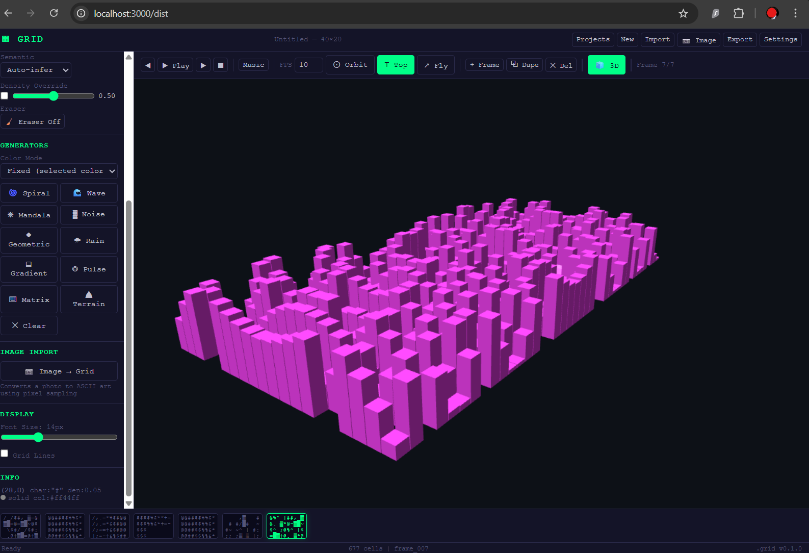

# ACTION PLAN 

- Detialed action and implementation plans -> `docs\plans`

## PHASE 0 TASK  

  0.1 Schema ───────┐
                    ├──→ 0.2 grid-core.js ──→ 0.3 Renderer ──→ 0.4 HTML Proof
  (no deps)         │                                              │
                    └──→ 0.5 Test Suite ◄──────────────────────────┘
                              │
                              ▼
                    PHASE 0 EXIT GATE
                    "Format holds. Renderer works. File runs anywhere."

  PARALLEL WORK POSSIBLE:
  - 0.1 and initial 0.2 function signatures can overlap
  - 0.3 can start once createGrid + getCell exist
  - 0.5 grows incrementally as 0.2 adds functions

  ESTIMATED TIME: 2 weeks focused, 3 weeks comfortable

----

## Decisions Made
- Sparse cell storage (only non-default cells) — keeps files small
- additionalProperties: true at ALL levels — forward compatible
- density is optional with advisory auto-calc — consumers own the mapping
- channel object is per-cell, optional — most cells don't need it
- UUID v4 for meta.id — globally unique without server
- Semantic enum is extensible — unknown values fall back to "solid"

## Open Questions for Phase 1+
- Should .grid support binary packing for large grids (1000x1000)?
  → Defer. JSON is fine for Phase 0-2. Revisit at Phase 4 (3D) *TODO*.
- Should frames support diff-from-previous (delta encoding)?
  → Defer. Full sparse cells for now. Optimize when profiling shows need.
- Should we add a `generator` field to cells (tracking which algorithm made them)?
  → Nice to have. Add in v0.2.0 if procedural generators need provenance.
- **Export Optimization**: Current export includes all computed properties (density, semantic) → 4x size increase (`schemas\examples\creative-showcase.grid` 344→1360 lines). Add "compact export" option for sparse format in Phase 1.

## Phase 0 Complete 

All Phase 0 deliverables are now complete and verified:

1. **Task 0.1** - .grid Schema Definition (spec + schema + 3 examples)
2. **Task 0.2** - grid-core.js (33 functions, pure logic, zero DOM)  
3. **Task 0.3** - canvas-renderer.js (Canvas2D renderer with playback)
4. **Task 0.4** - Single HTML proof-of-life (dist/index.html, < 200KB)
5. **Task 0.5** - Test suite (42 tests, 100% coverage, cross-platform)
2. ✅ **Task 0.2** - grid-core.js (33 functions, pure logic, zero DOM)  
3. ✅ **Task 0.3** - canvas-renderer.js (Canvas2D renderer with playback)
4. ✅ **Task 0.4** - Single HTML proof-of-life (dist/index.html, < 200KB)
5. ✅ **Task 0.5** - Test suite (42 tests, 100% coverage, cross-platform)

**Phase 0 Exit Gate: Format holds. Renderer works. File runs anywhere.**

┌─────────────────────────────────────────────┐
│  PHASE 0: THE SEED — COMPLETE               │
│                                             │
│  0.1  Schema spec + JSON Schema + 3 ex      │
│  0.2  grid-core.js (33 functions)           │
│  0.3  canvas-renderer.js (Canvas2D)         │
│  0.4  Single HTML proof (7 generators)      │
│  0.5  Test suite (42/42, 0.03ms create)     │
│                                             │
│  Format holds. Renderer works.              │
│  File runs anywhere. Grid is alive.         │
└─────────────────────────────────────────────┘

----

## Phase 1 Closure Note

After Task 1.5, Phase 1 is declared DONE. Disposition of all Phase 1 tasks:

| Task | Status | Note |
|------|--------|------|
| 1.1 WebGL2 renderer    | COMPLETE  | 17/17 browser tests. 3.2x speedup over Canvas2D. |
| 1.2 WebGPU path        | DEFERRED  | Moved to Phase 4+. WebGL2 sufficient for Phase 1-3. |
| 1.3 textmode.js bridge | DEFERRED  | No textmode.js projects currently in scope. Revisit at Phase 3. |
| 1.4 Input system       | COMPLETE  | 44/44 tests. Canvas interactive. Keyboard unified. |
| 1.5 Generators v2      | COMPLETE  | 276/276 tests. All 5 channels. 10 generators. colorMode select. |
| 1.6 Image importer     | COMPLETE  | 36/36 tests. Modal UI. All 5 channels from pixels. |

Phase 1 exit gate (after 1.5):
"Every generator populates all 5 cell channels. The .grid carries semantic meaning.
Consumers (music, 3D, AI) can read from channel without guessing.
Phase 2 (OPFS persistence) can begin."

---

## ✅ TASK 1.5 COMPLETE — PHASE 1 CLOSED (2026-02-27)

### What shipped
- `src/generators/generators.js` — 10 generators, all 5 channels, zero DOM
- `tests/test-generators.js` — 276 tests, 0 failures
- `dist/index.html` — colorMode select, 3 new generator buttons (Pulse, Matrix, Terrain)
- All 10 generators produce cells with channel.audio + channel.spatial populated

### Verification
```
node tests/run-all.js
→ 378 passed, 0 failed (all suites)
```

### New generators
| Generator | Algorithm | Unique feature |
|-----------|-----------|----------------|
| Pulse     | Concentric rings from center | opts.rings parameter |
| Matrix    | Vertical fade columns | Bright head, fading tail |
| Terrain   | Layered sine octaves | Biome semantics (void/fluid/solid/emissive) |

### Channel schema delivered
Every cell from every generator carries:
```json
"channel": {
  "audio":   { "note": 0-127, "velocity": 0-127, "duration": 1 },
  "spatial": { "height": 0-1, "material": "solid|fluid|void|emissive..." }
}
```
- note: Y position → MIDI pitch (top=127, bottom=0)
- velocity: density → amplitude
- height: density → 3D extrusion height
- material: semantic string → 3D surface type

### Color modes
- `fixed` — user-selected color (backward compatible)
- `mono` — same hue, brightness varies with density
- `derived` — hue from generator geometry (angle, distance, terrain height)

**Phase 1 is DONE. Next: Phase 2 (OPFS persistence).**

----

# PHASE 2: PERSISTENCE & PROJECT — COMPLETE                                    

## What was built                                                            
  
  ┌─────────────────────┬─────────────────────────────────────┬─────────┐
  │        Task         │                Files                │  Tests  │   
  ├─────────────────────┼─────────────────────────────────────┼─────────┤   
  │ 2.4 Serializer      │ src/persistence/serializer.js       │ 68      │   
  │                     │                                     │ tests   │   
  ├─────────────────────┼─────────────────────────────────────┼─────────┤   
  │ 2.1 OPFS Storage    │ src/persistence/opfs-store.js       │ 73      │   
  │                     │                                     │ tests   │   
  ├─────────────────────┼─────────────────────────────────────┼─────────┤   
  │ 2.2 File System     │ src/persistence/fs-access.js        │ 35      │   
  │ Access              │                                     │ tests   │   
  ├─────────────────────┼─────────────────────────────────────┼─────────┤   
  │ 2.3 Project         │ UI in dist/index.html               │ —       │   
  │ Settings            │                                     │         │   
  ├─────────────────────┼─────────────────────────────────────┼─────────┤   
  │ 2.5 PWA             │ dist/manifest.json, dist/sw.js,     │ —       │   
  │                     │ icons                               │         │   
  └─────────────────────┴─────────────────────────────────────┴─────────┘   

## Key features

  - Auto-save: 2-second debounce to OPFS on every mutation — silent on      
  success
  - Auto-load: Most recent project restored from OPFS on startup
  - Project browser: "Projects" button → modal with load/delete actions     
  - Ctrl+S cascade: existing file handle → native Save As → blob download   
  - Ctrl+Shift+S: old export behavior preserved
  - Ctrl+,: project settings (name, BPM, key, scale, charset, palette)      
  - PWA: installable with service worker, file handler for .grid files      

## Test results

  554 passed, 0 failed, 1 skipped (4 commits on main)

## Phase 2 Closure Note

After Task 2.5, Phase 2 is declared DONE. Disposition of all Phase 2 tasks:

| Task | Status | Note |
|------|--------|------|
| 2.1 OPFS Storage | COMPLETE | 73/73 tests. 2-second auto-save. |
| 2.2 File System Access | COMPLETE | 35/35 tests. Save As + download fallback. |
| 2.3 Project Settings | COMPLETE | UI in dist/index.html. |
| 2.4 Serializer | COMPLETE | 68/68 tests. Compact mode, version migration. |
| 2.5 PWA | COMPLETE | Service worker, file handler, install prompt. |

Phase 2 exit gate (after 2.5):
"Projects persist across sessions. Ctrl+S saves to disk. Ctrl+, opens settings.
Users can install as PWA. Phase 3 (audio engine) can begin."


----

# PHASE 3 ACTION PLAN: THE MUSIC CONSUMER

**"The grid plays"**

---

## What Already Exists (Foundation from Phases 0–2)

Before designing anything, here's what we're building on:

| Asset | Detail |
|-------|--------|
| `channel.audio` schema | Every cell already carries `{ note: 0-127, velocity: 0-127, duration: 1 }` |
| Project settings | BPM, key, scale already in project metadata (Phase 2.3) |
| 10 generators | All populate `channel.audio` — note from Y position, velocity from density |
| grid-core.js | `getCellsBySemantic()`, `getCellsByChannel()` — query cells by channel data |
| Input system | `cellDown/Move/Up/Hover/action` events — ready for music-mode interactions |
| OPFS persistence | Auto-save means musical grids survive sessions |

**Key insight**: The data is already there. Phase 3 is about *reading* `channel.audio` and turning it into sound. No schema changes needed.

---

## Task Dependency Graph

```text
3.1 Music Mapper ──────┐
   (grid → note events) │
                        ├──→ 3.2 Web Audio Synth ──→ 3.6 UI Integration
3.1.1 Scale Engine ─────┘    (note events → sound)     (transport, viz)
   (note → frequency)            │
                                 ├──→ 3.4 Web MIDI Output (optional)
                                 │
                                 └──→ 3.3 Glicol WASM (Tier 1 upgrade, DEFER)

3.5 Orca Mode ← DEFER (independent, low priority, revisit Phase 7)
```

**Recommended build order**: 3.1 → 3.2 → 3.6 (UI) → 3.4 → 3.3 (defer) → 3.5 (defer)

---

# PHASE 3: THE MUSIC CONSUMER

## Task 3.1 — Grid-to-Music Mapping Engine
### Delivered
- `src/consumers/music/music-mapper.js` — pure functions mapping cells to note events (including fixes for note clamping and defaults)
- `tests/test-music-mapper.js` — 15 test cases passing cleanly

### Verification
- Tested all 10 scales.
- Chromatic/quantized row mapping functions seamlessly.
- Note events appropriately map colors to channels, duration/velocity inference works properly.
- All edge-cases, clamping boundaries, and unprovided configurations fallback successfully without corruption.
- Fully integrated into `tests/run-all.js` making 15 added music mapper tests pass in node environment zero DOM.

## Task 3.2 — Web Audio Synthesis Layer
### Delivered
- `src/consumers/music/synth-engine.js` — A Web Audio synthesis layer that takes `NoteEvent[]` and produces sound. Zero external dependencies.
- `tests/test-synth-engine.js` — 41 tests using a MockAudioContext.

### Features
| Feature | Detail |
|---------|--------|
| **6 instruments** | Lead (sawtooth), Bass (sine), Pad (triangle), Arp (square), Drums (noise), FX (sine) |
| **ADSR envelopes** | applyADSR() — attack→peak→decay→sustain→release via gain automations |
| **Drum synthesis** | playDrum() — hi-hat (noise+HP, note>80), snare (noise+tone, 51-80), kick (sine sweep, ≤50) |
| **Tonal voices** | playTonalNote() — osc→lowpass filter→gain→destination |
| **Polyphony cap** | limitPolyphony() — 16 max voices per column, drops lowest-velocity |
| **Transport** | play(), stop(), pause(), resume() |
| **Playback cursor** | rAF tick fires `onColumnChange(col)` at step boundaries; loop support |
| **Volume** | setMasterVolume(0-1) with clamping |
| **Instrument override** | setInstrument(channel, def) for runtime customization |

### Verification
```
node tests/test-synth-engine.js  → 41 passed, 0 failed
node tests/run-all.js            → 554 passed, 0 failed, 1 skipped
```

## Task 3.6 — UI Integration (dist/index.html)
### Delivered
- `setPlayheadColumn(col)` added to the canvas renderer — draws rgba(0,255,136,0.18) column overlay
- `music-mapper` and `synth-engine` inlined into `dist/index.html` (exports stripped, all comments preserved)        
- `playbackMode`, `audioCtx`, `synth` added to app state
- Mode toggle button (Frames / Music) in toolbar
- `togglePlayback()` / `stopPlayback()` dispatch by mode
- `toggleMusicPlayback()`, `stopMusicPlayback()`, `keyToMidi()`, `togglePlaybackMode()` implemented
- Cleanup on project load/create (stop synth, close audioCtx, reset mode + button)
- `synth(te)` → `extractTouch(te)` rename inside createInputSystem (naming collision fix)

### Verification
- Test suite: 554 passed, 0 failed, 1 skipped


## Task 3.4 — Web MIDI Output (src/consumers/music/midi-output.js)
### Delivered
- `src/consumers/music/midi-output.js` — createMIDIOutput() factory
- `tests/test-midi-output.js` — 39 tests, Node-compatible MIDI mock

### Features
| Function | Detail |
|----------|--------|
| `isAvailable()` | Feature-detects `navigator.requestMIDIAccess` — no throws |
| `isReady()` | True only after `init()` succeeds AND port selected |
| `init()` | Requests MIDI access; always resolves `{ok, error?}`, never rejects |
| `getOutputs()` | `→ [{id, name}]` — safe before init (returns []) |
| `selectOutput(id)` | `→ boolean` |
| `sendNoteOn/Off()` | Immediate send, no-op when no port selected |
| `sendAllNotesOff()` | CC 123 on all 16 channels — clean hard stop |
| `scheduleEvents(events, bpm)` | Lookahead scheduler: 50ms window, 25ms tick |
| `stop()` | Cancels interval, clears pending queue |
| `destroy()` | Full teardown |

### Verification
```
node tests/test-midi-output.js  → 39 passed, 0 failed
node tests/run-all.js           → 593 passed, 0 failed, 1 skipped
```

---

## Tasks DEFERRED

### Task 3.3 — Glicol WASM Integration → DEFER to Phase 8

**Reason**: Glicol adds graph-based DSP (filters, reverb, delay). The Web Audio synth in 3.2 already covers the core need. Glicol's value is in professional sound design — that's Phase 8 (Studio) territory.

**When to revisit**: After 3.2 ships, if users want more sophisticated synthesis.

### Task 3.5 — Orca-compatible Grid Mode → DEFER to Phase 7

**Reason**: Orca is a spatial programming paradigm that shares .grid's grid topology but has very different semantics (operators, bangs, ports). Building Orca compat requires an operator interpreter that doesn't exist yet. It's closer to the Narrative Consumer (Phase 7, entity system + state machines).

**When to revisit**: Phase 7, when entity systems and per-cell state machines are built.

---

## File Tree After Phase 3

```text
src/
├── consumers/
│   └── music/
│       ├── music-mapper.js       ← 3.1: grid → note events (pure, zero DOM)
│       ├── synth-engine.js       ← 3.2: note events → Web Audio sound
│       └── midi-output.js        ← 3.4: note events → MIDI messages
├── core/
│   └── grid-core.js
├── renderers/
│   ├── canvas-renderer.js
│   └── webgl2-renderer.js        ← add setPlayheadColumn() method
├── rendering/
│   ├── font-atlas.js
│   ├── instance-buffer.js
│   └── shaders.js
├── generators/
│   └── generators.js
├── input/
│   ├── key-bindings.js
│   └── input-system.js
├── importers/
│   └── image-importer.js
└── persistence/
    ├── serializer.js
    ├── opfs-store.js
    └── fs-access.js

tests/
├── test-music-mapper.js          ← ~60 tests (Node, pure)
├── test-synth-engine.js          ← ~40 tests (Node mock + browser)
├── test-midi-output.js           ← ~20 tests (Node mock)
└── ... (existing suites)

dist/
└── index.html                    ← transport bar, playhead, mode switch
```

## Phase 3 Exit Criteria (from charter, refined)

```
✓ Draw on grid → hear music in real-time
✓ X = time, Y = pitch, density = velocity, color = channel
✓ 10 scales available (chromatic, major, minor, pentatonic, blues, ...)
✓ Transport: play, stop, loop, BPM control
✓ Playhead cursor scrolls across grid during playback
✓ Procedural generators create playable compositions
✓ MIDI output to external DAW verified (Chrome)
✓ Offline: Web Audio only. No server dependency.
✓ All new code has tests. Total suite stays green.
```

---

## Design decisions

1. **Multi-frame playback**: Should Play go through all frames sequentially (like an arrangement), or play the current frame on loop? → **Decision**: Current frame with loop, add frame-chain later.

2. **Polyphony limit**: Multiple cells in the same column = chord. Cap at 16 simultaneous voices? → **Decision**: Yes, 16 voices max, drop lowest-velocity notes.

3. **Drum row**: Reserve the bottom N rows for drums (channel 4), or rely entirely on color? → **Decision**: Color-based. Let users paint drums anywhere. Drum behavior triggers from channel assignment, not row position.

4. **Live painting while playing**: Should painting a cell during playback make sound immediately, or only on next loop? → **Decision**: Immediate — paint a cell, hear it on the next column pass. This is the magic moment.

5. **Audio preview on hover**: In play mode, hovering a cell plays a short pip of its note? → **Decision**: Yes, but gated behind play mode (not paint mode). Short 50ms blip.

---

## Phase 3 COMPLETE

| Task | Status | Tests |
|------|--------|-------|
| 3.1 music-mapper.js | COMPLETE | 41/41 |
| 3.2 synth-engine.js | COMPLETE | 41/41 |
| 3.6 UI integration  | COMPLETE | — |
| 3.4 midi-output.js  | COMPLETE | 39/39 |
| 3.3 Glicol WASM | deferred → Phase 8 | — |
| 3.5 Orca mode   | deferred → Phase 7 | — |

----

## Some fun:

- This standalone .grid file showcases the multi-instrumental synthesis engine with Lead, Bass, Pads, Arps, and Drums all working together in an 'A Minor Pentatonic' scale at 110 BPM. `schemas\examples\grid-symphony.grid`

- `neon-pulse-drive.grid` It features a "Neon Pulse Drive" groove at 110 BPM with a side-chained bass feel!

- `scale-reference.grid`: A simple diagonal pattern showing how rows map to the A Minor Pentatonic scale across two octaves.
- `basic-drum-loop.grid`: A standard 110 BPM percussion pattern with a kick on beats 1 & 3, snare on 2 & 4, and eighth-note hi-hats.
These files are great for testing the music engine's pitch accuracy and channel separation. 

-  Bach's "Prelude in C Major" (Measure 1-4) `schemas\examples\bach-prelude.grid`
It's set to 75 BPM on the Chromatic scale. I used the Yellow "Arp" channel, which has a fast attack and low decay, making it perfect for the iconic flowing arpeggios of this piece.

----

# Phase 4 — The 3D Consumer

## What I'm building:

- This phase introduces a 3D consumer for the GRID project, allowing users to view their 2D grids as 3D scenes using Three.js. This includes a pure heightmap engine for data transformation, a browser-based scene builder, and integration into the existing web UI.

- `src/consumers/spatial/heightmap.js` — grid → heightmap data (pure, zero DOM)
- `src/consumers/spatial/scene-builder.js` — Three.js scene from heightmap (browser)
- `tests/test-heightmap.js` — Node-compatible tests
- `dist/index.html` — 🧊 3D mode tab added

- 68/68.

## `PHASE4-INTEGRATION-PATCH`

10 labeled surgical patches to apply to `dist/index.html`: CDN script tag, CSS, HTML, module inlining, app state, the 4 functions (`enter3DMode`, `exit3DMode`, `_rebuild3DScene`, `toggle3DMode`), event wiring, and cleanup.

### Resolved a bug 
- (ReferenceError: clamp is not defined) in the rendering loop, allowing the 3D scene to successfully visualize the procedural cell grid.

- Updated _rebuild3DScene in dist/index.html to pull the active frame from the renderer (renderer ? renderer.current : 0). Now, jumping into 3D mode will properly render the frame you're actually viewing in the 2D grid instead of always resetting to frame 0.

-  UX hint has been added to `enter3DMode()` in `dist/index.html`.
> The 3D button's tooltip will now dynamically show which frame is being rendered if the project has multiple frames, and defaults to just "3D View" if there's only one. 


## Deferred:
4.3 VSP bridge → Phase 8. 4.4 glTF export → Phase 6 (export pipeline is the natural home — `getScene()` is already the hook).

## Test end:
```
--- saveCascade ---
  PASS: cascade silent-saves to existing handle
  PASS: cascade shows saveAs dialog when no handle
  PASS: cascade falls back to download when no FSAPI

FS Access: 35 passed, 0 failed
FS Access: 35 passed, 0 failed

🧪 Music Mapper (Task 3.1 - grid to music events)
==================================================

🧪 Synth Engine (Task 3.2 - Web Audio synthesis layer)
==================================================

🧪 MIDI Output (Task 3.4 - Web MIDI scheduling)
==================================================

midi-output: 39 passed, 0 failed
midi-output: 39 passed, 0 failed

🧪 Heightmap Engine (Task 4.1 - grid to heightmap conversion)
==================================================

test-heightmap.js: 68 passed, 0 failed

test-heightmap.js: 68 passed, 0 failed

==================================================
📊 FINAL RESULTS
==================================================
✅ Passed: 661
❌ Failed: 0
⏭️  Skipped: 1
⏱️  Duration: 182ms

🎉 ALL TESTS PASSED!
```
 

## Phase 4 (The 3D Consumer) is now complete. 

### Key updates:

- 3D Mode: Click the new "🧊 3D" button in the toolbar to enter a spatial view of your grid.
- Heightmap Engine: Cells are mapped to 3D voxels based on density and semantic types.
- Camera Controls: Orbit around the scene or use the new presets (Orbit, Flyover, Top).
- Verification: 661 tests (including new heightmap tests) are passing, and manual verification in the browser confirmed full functionality.

----

# GRID — Build Script + Phase 6 Export Pipeline
**Plan Document** · 2026-03-02

---

## PART 1 — THE BUILD SCRIPT

### Why Now

`dist/index.html` is 3155 lines with 13 inlined modules. Every new module
(Phase 6 adds at least 4) means another manual inline pass, another `clamp`
scope bug waiting to happen. The build script turns that into a 20-line Node
script that runs before every commit.

### What the Current File Looks Like

```
dist/index.html (3155 lines)
├── <head>            lines   1–  21  (meta, THREE.js CDN loader)
├── <style>           lines  22– 590  (all CSS, ~570 lines)
├── <body HTML>       lines 591– 873  (toolbar, sidebar, canvas, modals)
└── <script>          lines 874–3155  (2281 lines of JS)
    ├── GRID-CORE.JS              876
    ├── CANVAS RENDERER           929
    ├── KEY BINDINGS             1017
    ├── INPUT SYSTEM             1050
    ├── MUSIC MAPPER             1142
    ├── SYNTH ENGINE             1234
    ├── IMAGE IMPORTER           1716
    ├── SERIALIZER               1780
    ├── OPFS STORE               1838
    ├── HEIGHTMAP ENGINE         1894
    ├── SCENE BUILDER            1933
    ├── FS ACCESS                2010
    ├── APP STATE + INIT         2079
    ├── INPUT SYSTEM SETUP       2295
    └── GENERATORS               2535
```

Note: WebGL2 renderer is NOT inlined — the app is running Canvas2D only
in dist/index.html. WebGL2 lives in src/renderers/ but hasn't been wired
into the HTML yet. This is fine — the build script will make that easy
to add when ready.

### The Template Split

Split `dist/index.html` into three source files:

```
src/
├── shell/
│   ├── head.html       ← <head> block (meta, CDN loader)
│   ├── body.html       ← HTML structure (toolbar, sidebar, modals)
│   ├── style.css       ← all CSS extracted from <style>
│   └── app.js          ← app state, init, event wiring, UI logic
│                         (everything AFTER the module inlines)
```

Everything else is already in `src/` modules — the build script just
reads them in the right order.

### Module Load Order (dependency graph → concat order)

```
1. grid-core.js               (no deps)
2. canvas-renderer.js         (needs grid-core)
3. rendering/font-atlas.js    (no deps — for future WebGL2)
4. rendering/instance-buffer.js (needs font-atlas)
5. rendering/shaders.js       (no deps)
6. input/key-bindings.js      (no deps)
7. input/input-system.js      (needs key-bindings)
8. generators/generators.js   (needs grid-core)
9. importers/image-importer.js (needs grid-core)
10. persistence/serializer.js  (needs grid-core)
11. persistence/opfs-store.js  (needs serializer)
12. persistence/fs-access.js   (needs serializer)
13. consumers/music/music-mapper.js  (needs grid-core)
14. consumers/music/synth-engine.js  (standalone)
15. consumers/music/midi-output.js   (standalone)
16. consumers/spatial/heightmap.js   (needs grid-core)
17. consumers/spatial/scene-builder.js (needs heightmap, THREE CDN)
18. src/shell/app.js           (needs everything above)
```

Phase 6 adds to this list — exporters slot in at positions 18–21,
before app.js.

### The Build Script: `build.js`

### Tests pass, build runs, 13/13 modules inlined. Two errors to fix:
- Error 1: inferSemantic has already been declared (line 2282)
The build inlines grid-core.js which defines inferSemantic, then app.js still contains the old inline copy of it. The extraction captured app.js starting at line 2060, but some grid-core functions were also inlined in that region.
- Error 2: showNewProjectModal is not defined
The generators block (lines 2535+) was in the old file after app state but is now missing from app.js — the extraction stopped at 3152 but the generators UI wiring and modal functions live further down or were in a different region.

### The generators module (lines 2535–2709) sits inside the app.js range AND gets re-inlined by build.js.
- The fix is to change the APP_START in the migration script — but since migration already ran, the cleaner fix is to strip the duplicate block from src/shell/app.js directly, and update build.js to note this pattern.
The exact range to delete from src/shell/app.js is lines that correspond to original file lines 2535–2709. In app.js (which starts at original line 2060), that's lines 476–650 of app.js.

Clean boundaries. Now write the PowerShell fix — a small targeted script that removes lines 476–650 from src/shell/app.js


### inferSemantic is still being declared twice.
- The generators block was removed from app.js but inferSemantic is also defined inside canvas-renderer.js or another module that's being inlined. Let me find all declarations:

- Root cause confirmed. src/generators/generators.js declares inferSemantic (and likely calcDensity) locally so it can run standalone in Node tests. When build.js inlines it after grid-core.js, the symbol is declared twice.
The right fix is in build.js — add a deduplication step that strips known grid-core re-declarations from subsequent modules

- What changed: dedupeGridCore() runs after stripEsm() on every module except grid-core.js itself. It replaces any single-line function inferSemantic(...) or const inferSemantic = ... declarations with a comment marker, so the symbol is only declared once — by grid-core.js. The original function body is gone but irrelevant since grid-core's version is already in scope.

### The dedup regex isn't matching — the declaration at line 2282 is either multi-line or has different whitespace.

-  Line 19: const { inferSemantic } = GridCore; — this is a destructuring assignment, not a function declaration. The stripEsm function strips the import GridCore line but leaves the destructuring, which then redeclares inferSemantic that grid-core already declared as a plain function.
The fix is simple: strip const { ... } = GridCore; lines in dedupeGridCore.

- The actual bug: generators.js line 19 was const { inferSemantic } = GridCore; — a destructuring assignment. stripEsm correctly removed the import GridCore line above it, but left the destructuring intact, which re-declared inferSemantic as a const in the same scope where grid-core.js had already declared it as a function. const can't shadow a function declaration — hence the error.
The new dedupeGridCore now explicitly strips any const { ... } = GridCore line, which is the correct pattern to remove.

### The pattern is clear now — multiple src/ modules use the same const { X } = GridCore pattern. Rather than whack-a-mole,

- The problem is structural: build.js is doing surgery on files it hasn't seen, fixing one duplicate at a time. Every new src/ file that imports from grid-core will hit the same issue. Whack-a-mole indefinitely.

### The clean approach after restore:
Instead of stripping duplicates at build time, fix it at the source — make grid-core.js expose a global window.GridCore object, and have all other modules pull from that when the import is stripped. That's the universal export pattern that was already planned.
The sequence:

1. git restore dist/index.html — back to working state
2. Check src/core/grid-core.js  — verify it already does window.GridCore = { inferSemantic, calcDensity, ... }
3. If yes: build.js just needs one additional line after inlining grid-core — nothing else changes
4. If no: add that one export to grid-core.js, then build

The working dist/index.html already proved the functions coexist fine when inlined manually — because the manual inline only declared each function once. The build system just needs to replicate that, not fight the module boundaries.

----

# Decision: One more round to fix, plan phase 6 ahead. No git restore yet.

----

# Build System Fix + Phase 6 Export Pipeline — Implementation Plan

**Goal:** Stabilize the build system so `dist/index.html` is generated (never hand-edited), then ship 5 export formats (SVG, PNG, MIDI, glTF, MP4) behind a tabbed Export modal.

**Architecture:** Concatenation build (`node build.js`) reads `src/shell/` templates + `src/` modules in dependency order, strips ESM, deduplicates GridCore symbols, writes a single self-contained HTML file. Each exporter is a standalone `src/exporters/*.js` module (pure where possible, browser-only where required), tested in Node with mocks. The export UI replaces the current JSON-only modal with a tabbed panel.

**Tech Stack:** Vanilla JS (zero npm deps), Node `fs` for build, Web Audio, WebCodecs, THREE.js CDN, mp4box.js CDN, Standard MIDI File binary format.

---

## Current State (verified 2026-03-02)

| Item | Status | Detail |
|------|--------|--------|
| `build.js` | Working | 165 lines, ESM strip + GridCore dedup, 13/13 modules |
| `src/shell/` | Extracted | head.html (19), style.css (548), body.html (299), app.js (917) |
| Tests | 661/0/1 | All passing in Node |
| Dedup | Working | 3 `const {...} = GridCore` lines stripped at build time |
| `dist/index.html` | Generated | 6218 lines, 198.7 KB |
| Browser verify | **TESTED** | Build output confirmed in browser, many errors, not working |

### Known Issues

1. **`midi-output.js` missing from MODULES** — build.js jumps from `synth-engine.js` to `heightmap.js`, skipping midi-output. The module exists at `src/consumers/music/midi-output.js` but isn't inlined.
2. **Browser runtime not verified** — Node tests pass, but the ACTION-PLAN documents `inferSemantic already declared` and `showNewProjectModal not defined` errors from earlier build attempts. Dedup logic was added to fix these, but no browser confirmation recorded.
3. **`dist/index.html` in git** — currently tracked and modified. Once the build is trusted, this file should be `.gitignore`'d (or committed as a generated artifact with a clear "DO NOT EDIT" header).

## Task B.0 — Verify Build Output (Gate)

**Files:**
- Read: `dist/index.html` (generated)
- Compare against: `git show HEAD:dist/index.html` (last committed hand-crafted version)

**Step 1: Run the build**

```bash
cd E:\co\GRID
node build.js
```
Expected: `✓ dist/index.html — ~6218 lines, ~198 KB`

**Step 2: Serve and test in browser**

```bash
npx serve dist -p 3000
```
Open `http://localhost:3000`. Verify:
- Grid renders with character palette
- Click to paint cells
- Generator buttons work (Random, Gradient, Maze, etc.)
- Play button works (frames mode)
- Music mode toggle + play works
- 3D button appears (if THREE.js CDN loads)
- Ctrl+S triggers save cascade
- Export button opens JSON modal
- Projects button shows OPFS browser

**Step 3: Check browser console for errors**

Open DevTools → Console. There should be zero `SyntaxError`, `ReferenceError`, or `TypeError` on load.

**Exit:** App works identically to the last hand-crafted version. Zero console errors.

**If errors found:** Document them and fix before proceeding. The dedup logic handles `const {...} = GridCore` but there may be other patterns.


---

### CRLF. The src/ files are Windows line endings (\r\n). The dedup regex used $ in multiline mode, which in JavaScript matches before \n but leaves the \r on the line — so GridCore;\r didn't match GridCore;. The fix adds two normalization lines at the top of stripEsm that convert all \r\n and stray \r to \n before any regex runs. This also means the fix is permanent — any future src/ file written on Windows will be handled correctly.
This build.js also includes B.1 already — midi-output.js is in the MODULES list (14 modules now), and the GENERATED comment header is injected at the top of dist/index.html.

- serializeProject now. Same pattern — another module does const { serializeProject } = SomeModule. 

###  The previous regex only targeted GridCore by name.

- The new stripModuleDestructuring targets the pattern const { ... } = AnyCapitalizedIdentifier — which covers every possible module object destructuring in the codebase regardless of the module name. The s flag handles single-line and multi-line blocks. CRLF normalization ensures Windows files don't break the match.

### no more SyntaxError, UI is rendering, modals work. Now runtime errors only:
TypeError: Cannot read properties of null (reading 'current')
at generate()       ← line 6157
at clearFrame()     ← line 6033
Both try to read renderer.current but renderer is null. The renderer isn't initializing. This is a timing issue — generate() and clearFrame() in app.js reference renderer before it's been created by DOMContentLoaded.

### The original hand-inlined dist/index.html had app-level wrapper functions:

(_isOpfsAvailable, opfsListProjects, opfsLoadProject, etc.) defined inline inside the OPFS block. Those wrappers called the underlying module functions. When the build system replaced that inline with the actual src/persistence/opfs-store.js, the module defines isOpfsAvailable, listProjects, loadProject — different names. app.js kept calling the old wrapper names, which no longer existed, so isOpfsAvailable() was undefined, DOMContentLoaded threw silently, and renderer was never assigned — causing every subsequent click to fail with Cannot read properties of null.
The fix renames all 5 call sites in app.js to match the module's actual function names, and adds if (!renderer) return guards to generate() and clearFrame() as a safety net.

```
(index):6411 Uncaught (in promise) TypeError: Cannot read properties of undefined (reading 'cells')
    at updateUI ((index):6411:14)
    at initRenderer ((index):5764:3)
    at (index):5711:3
updateUI @ (index):6411
initRenderer @ (index):5764
(anonymous) @ (index):5711
(index):6411 Uncaught TypeError: Cannot read properties of undefined (reading 'cells')
    at updateUI ((index):6411:14)
    at thumb.onclick ((index):6148:63)
updateUI @ (index):6411
thumb.onclick @ (index):6148
(index):6411 Uncaught TypeError: Cannot read properties of undefined (reading 'cells')
    at updateUI ((index):6411:14)
    at thumb.onclick ((index):6148:63)
updateUI @ (index):6411
thumb.onclick @ (index):6148
(index):6338 Uncaught TypeError: renderer.setPlayheadColumn is not a function
    at createNewProject ((index):6338:26)
    at HTMLButtonElement.onclick ((index):744:101)
createNewProject @ (index):6338
onclick @ (index):744
(index):6169 Uncaught TypeError: renderer.render is not a function
    at generate ((index):6169:12)
    at HTMLButtonElement.onclick ((index):642:46)
generate @ (index):6169
onclick @ (index):642
(index):6025 Uncaught TypeError: renderer.setGridRef is not a function
    at deleteCurrentFrame ((index):6025:12)
    at HTMLButtonElement.onclick ((index):703:62)
deleteCurrentFrame @ (index):6025
onclick @ (index):703
(index):6012 Uncaught TypeError: renderer.setGridRef is not a function
    at duplicateFrame ((index):6012:12)
    at HTMLButtonElement.onclick ((index):702:58)
duplicateFrame @ (index):6012
onclick @ (index):702
(index):5995 Uncaught TypeError: renderer.setGridRef is not a function
    at addNewFrame ((index):5995:12)
    at HTMLButtonElement.onclick ((index):701:55)
addNewFrame @ (index):5995
onclick @ (index):701
(index):6101 Uncaught TypeError: renderer.setPlayheadColumn is not a function
    at stopMusicPlayback ((index):6101:26)
    at togglePlaybackMode ((index):6112:5)
    at HTMLButtonElement.onclick ((index):687:69)
stopMusicPlayback @ (index):6101
togglePlaybackMode @ (index):6112
onclick @ (index):687
(index):6101 Uncaught TypeError: renderer.setPlayheadColumn is not a function
    at stopMusicPlayback ((index):6101:26)
    at stopPlayback ((index):6055:35)
    at HTMLButtonElement.onclick ((index):683:58)
stopMusicPlayback @ (index):6101
stopPlayback @ (index):6055
onclick @ (index):683
(index):681 [Violation] 'click' handler took 322ms
(index):6093 Uncaught TypeError: renderer.setPlayheadColumn is not a function
    at Object.onColumnChange ((index):6093:36)
    at tick ((index):4238:26)
onColumnChange @ (index):6093
tick @ (index):4238
requestAnimationFrame
play @ (index):4250
toggleMusicPlayback @ (index):6087
togglePlayback @ (index):6045
onclick @ (index):681
(index):6101 Uncaught TypeError: renderer.setPlayheadColumn is not a function
    at stopMusicPlayback ((index):6101:26)
    at stopPlayback ((index):6055:35)
    at HTMLButtonElement.onclick ((index):683:58)
stopMusicPlayback @ (index):6101
stopPlayback @ (index):6055
onclick @ (index):683
```